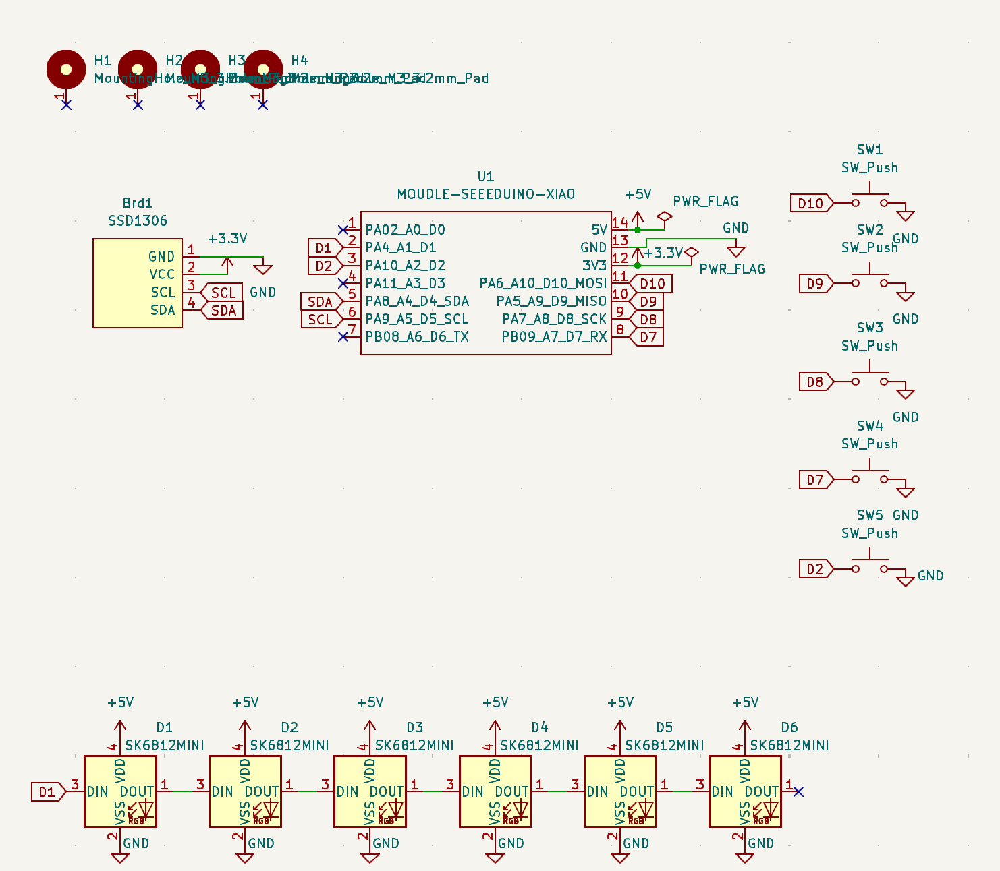
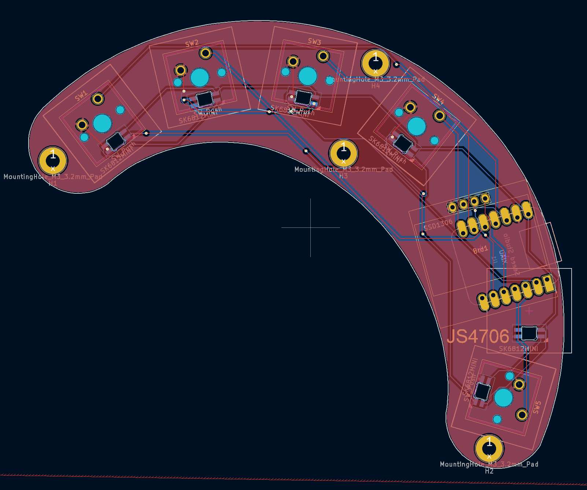

# Justins_Macropad

A 5-key macropad with RGB underglow and OLED display, built around the Seeed XIAO RP2040. Designed for general shortcuts and everyday productivity. Macropad was designed off a sketch of my fingers so its perfectly ergonomic :)

---

## Challenges

This is my first PCB I am planning to manafacture, I used fusion to create the layout using a dxf using a sketch on paper. The keys are positioned to the size and position of my hand. After multiple changes I was eventually happy with the result. Fusion360 was used for 3D modelling with no issues.

---

## Schematic

---

## PCB

---

## Case

3D printed two-part case designed to fit the PCB securely, with M3 mounting holes for assembly.

---

## Bill of Materials (BOM)

| Component | Designator | Footprint | Quantity |
|-----------|------------|-----------|----------|
| Seeed XIAO RP2040 | U1 | XIAO-Generic-Hybrid-14P-2.54-21X17.8MM | 1 |
| SK6812MINI RGB LED | D1–D6 | MX_SK6812MINI-E | 6 |
| Cherry MX Push Button Switch | SW1–SW5 | SW_Cherry_MX_1.00u_PCB | 5 |
| SSD1306 128x64 OLED Display | Brd1 | 128x64OLED | 1 |
| M3 Mounting Hole (3.2mm Pad) | H1–H4 | MountingHole_3.2mm_Pad | 4 |
| M3 Screws | — | — | 4 |
| M3 Heat Inserts | — | — | 4 |
| 3D Printed Case | — | — | 1 |

---

## Firmware

This macropad runs [KMK](https://github.com/KMKfw/kmk_firmware) on CircuitPython.

### Setup

1. Flash CircuitPython from [circuitpython.org/board/seeeduino_xiao_rp2040](https://circuitpython.org/board/seeeduino_xiao_rp2040)
2. Copy the `kmk` folder to your `CIRCUITPY` drive
3. Copy `main.py` to the root of your `CIRCUITPY` drive

### Pin Mapping

| Switch | XIAO Pin | GPIO |
|--------|----------|------|
| SW1 | D10 | GP4 |
| SW2 | D9 | GP3 |
| SW3 | D8 | GP2 |
| SW4 | D7 | GP1 |
| SW5 | D2 | GP28 |
| RGB Data | D1 | GP27 |
| OLED SDA | D4 | GP6 |
| OLED SCL | D5 | GP7 |

---

## License

Open source hardware. Feel free to use, modify, and build on this project!
